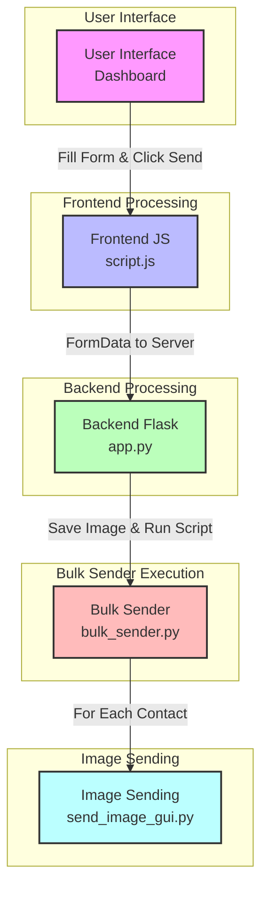
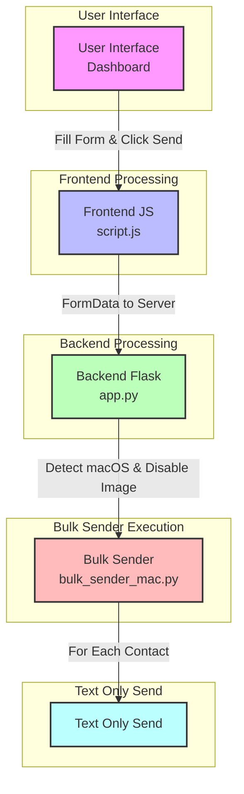
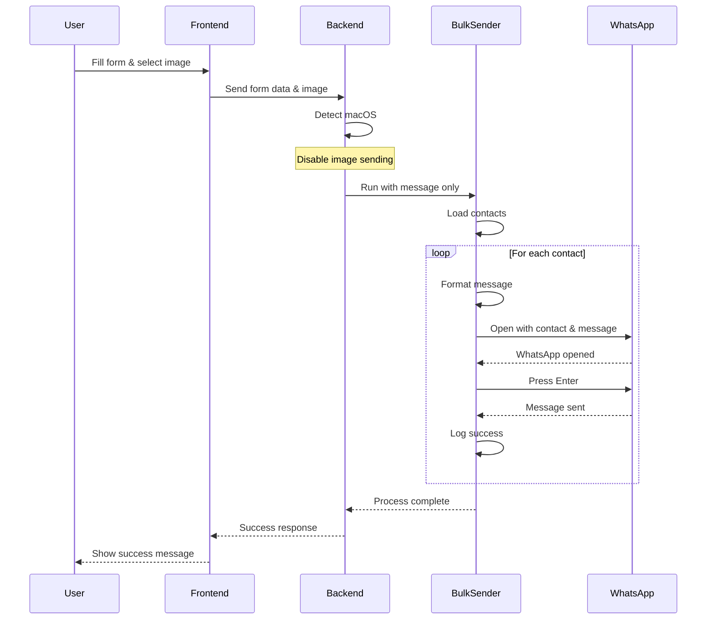
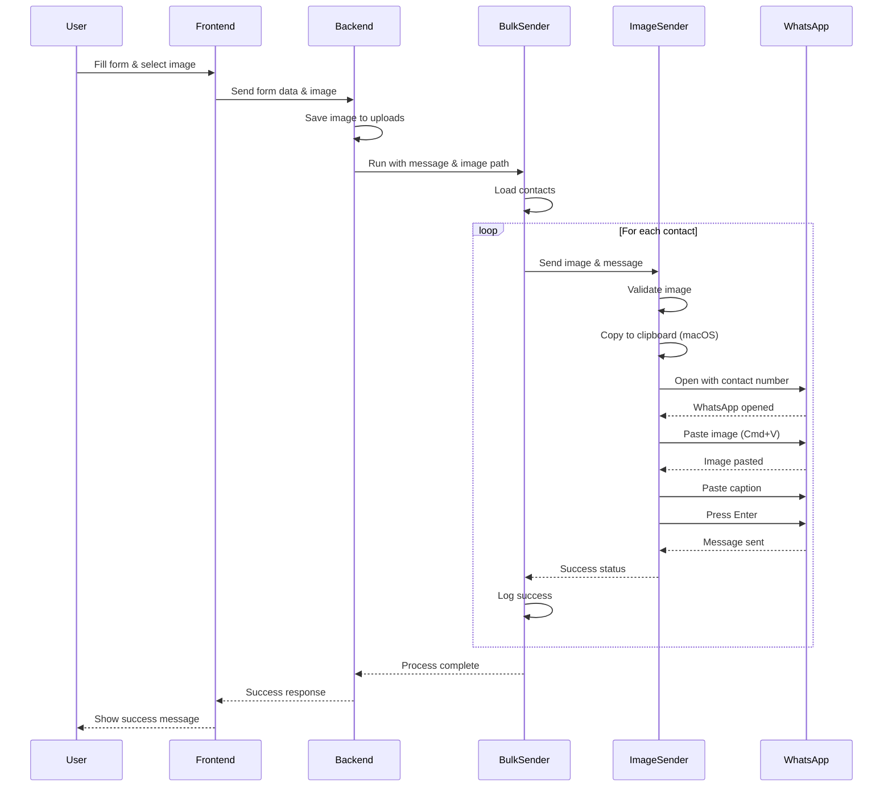

# Image Send Flow - Mermaid Diagrams

## Windows Flow



## macOS Flow



## Detailed Windows Image Handling


## Detailed macOS Image Handling (Current)



## Detailed macOS Image Handling (Proposed)



## Debugging Tools

Here are some tools you can use to visualize and debug the flow:

1. **Mermaid Live Editor**: https://mermaid.live/
   - Paste the Mermaid code to visualize the diagrams
   - Export as SVG, PNG, or other formats

2. **Draw.io (diagrams.net)**: https://app.diagrams.net/
   - Create interactive flowcharts
   - Export in various formats
   - Integrates with GitHub, Google Drive, etc.

3. **Python Visualization Libraries**:
   ```python
   # Example using Graphviz
   from graphviz import Digraph
   
   dot = Digraph(comment='Image Send Flow')
   dot.attr(rankdir='LR')
   
   # Add nodes
   dot.node('A', 'User Interface')
   dot.node('B', 'Frontend JS')
   dot.node('C', 'Backend Flask')
   dot.node('D', 'Bulk Sender')
   dot.node('E', 'Image Sending')
   
   # Add edges
   dot.edge('A', 'B', 'Fill Form & Click Send')
   dot.edge('B', 'C', 'FormData to Server')
   dot.edge('C', 'D', 'Save Image & Run Script')
   dot.edge('D', 'E', 'For Each Contact')
   
   # Save the graph
   dot.render('image_send_flow', format='png', cleanup=True)
   ```

4. **Debugging Tools**:
   - **Python Debugger (pdb)**: Add breakpoints in your code
   - **Visual Studio Code Debugger**: Set breakpoints and step through code
   - **PyCharm Debugger**: Visual debugging with variable inspection
   - **Logging**: Add detailed logging to track the flow

5. **Flow Monitoring**:
   - **Python logging**: Add detailed logs at each step
   - **Performance profiling**: Use cProfile to identify bottlenecks
   - **State tracking**: Implement state machines to track progress 